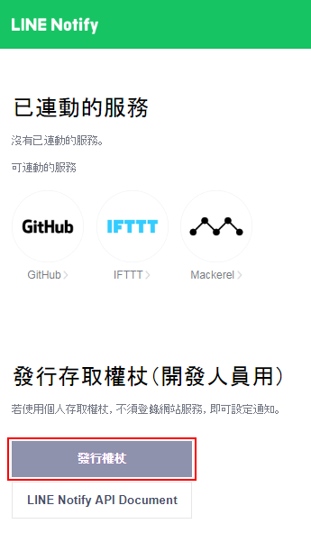
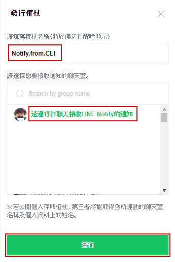
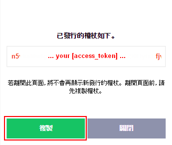
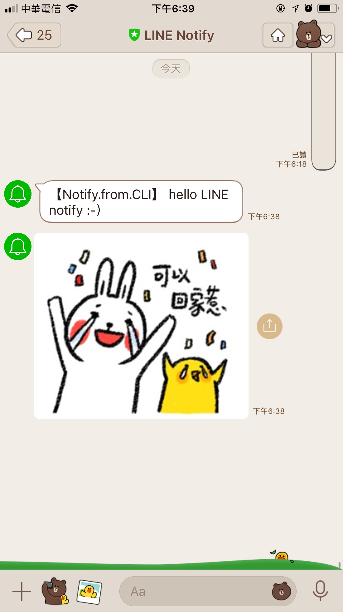
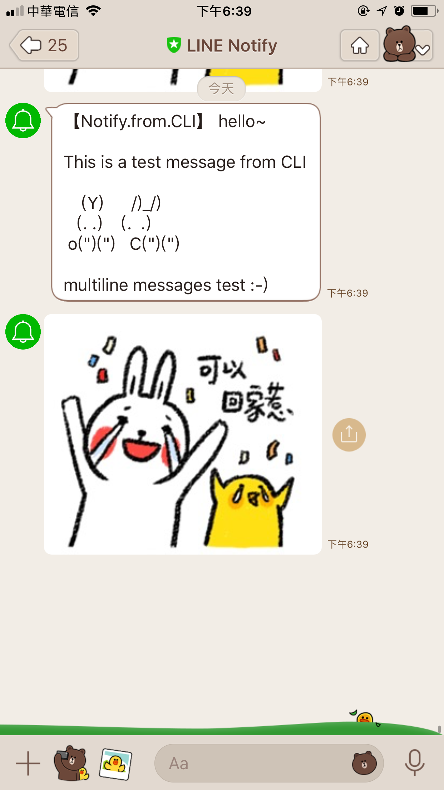

# line-notify-from-cli

## When to use?

I study this topic is because when I do a full build in a compile server. That will be good if I can get a notify message when the build process is done.

For example, When I use the following command:

	$ make clean && make V=s; ./line-notify.sh "build is done"

I would like to get the message "build is done" in my smartphone LINE app.

And I think this simple script could be integrated into an auto-build system in the future.

## Requestment

All you need to use are the **access token** and **line-notify.sh**. I also suggest you run the script in **Ubuntu Linux** and use a **bash** environment. Not request to install the [jq](https://stedolan.github.io/jq/download/) package but that will be good if you can install it.

## How to use

### 1. Get your Access Token

Generating personal access tokens by navigating to [My page](https://notify-bot.line.me/my/) (LINE account required).

for more details please visit the website: [Using LINE Notify to send messages to LINE from the command-line](https://engineering.linecorp.com/en/blog/using-line-notify-to-send-messages-to-line-from-the-command-line/)

It actually only need 3 steps:

Step1:

Step2:

Step3:

That's all!

### 2. Edit the script

	$ vi ./line-notify.sh

change the following variables values:

* **access_token** - replace with your personal access token.
* **is_show_img** (optional) - if set the value to 1, assign a image URL to **IMG_URL** variable.

### 3. Have fun :-)

#### case1: send a simple message

The command example:

	$ ./line-notify.sh "hello LINE notify :-)"

or

	$ echo "hello LINE notify :-)" | ./line-notify.sh

the notification you got in LINE.

#### case2: send multiple messages

You can prepare a file that including your messages. For example:

	$ cat ex-msg.txt
	hello~

	This is a test message from CLI

	    (Y)      /)_/)
	   (. .)    (.  .)
	 o(")(")   C(")(")

	multiline messages test :-)

The command example:

	$ ./line-notify.sh < ex-msg.txt

the notification you got in LINE.

~ END ~

